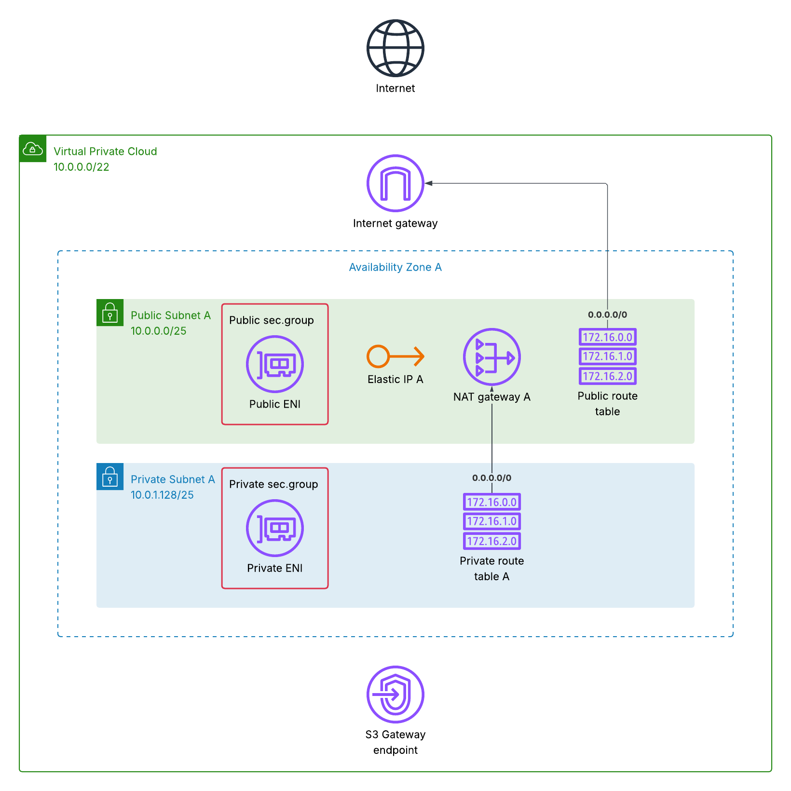

## AWS Reachability Analyzer Demo

See the blog at https://carriagereturn.nl/aws/vpc/network/reachability/analyzer/2025/06/19/analyzethis.html for details.

Cloudformation template to build a demo environment for testing AWS Reachability Analyzer

* VpcCIDR (10.0.0.0/22), IP range of VPC in format a.b.c.d/xx
* AvailabilityZones (a), comma separated list of AZ to deploy resources
* BrokenNACL (false), when true will deploy NACL blocking some traffic

